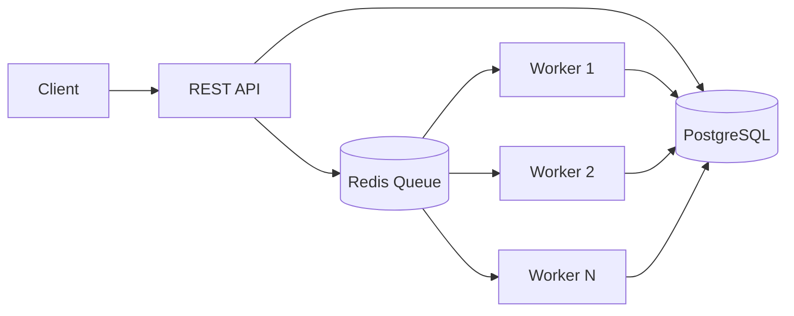
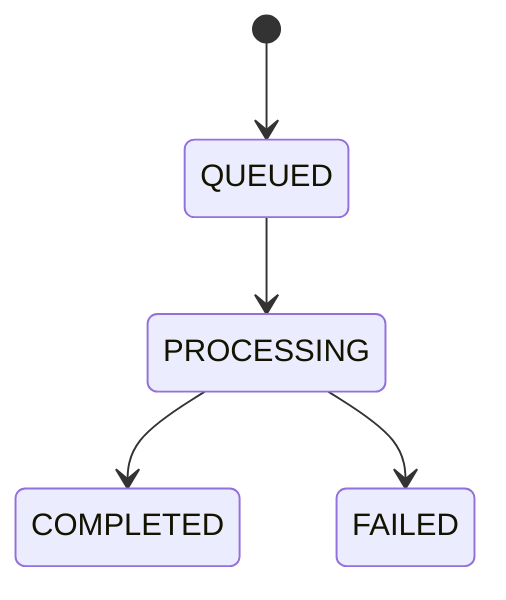

# Distributed Job Queue

Backend distributed job system built with TypeScript, Node.js, PostgreSQL, Redis, and Docker.

The goal is not to recreate BullMQ feature-for-feature. The goal is to understand the engineering problems behind background processing: safe job claiming, worker coordination, retries, scheduling, observability, and deployment.

## Project Status

The codebase is in Stage 2 of the roadmap.

- PostgreSQL stores durable job metadata and results.
- The worker currently claims jobs from PostgreSQL with an atomic compare-and-set pattern.
- Redis-based queue coordination is the next step and is documented in the local Stage 2 checklist.

## Architecture



PostgreSQL is the source of truth for job state, while Redis coordinates pending work between workers.

## Job Lifecycle

Current job states:



Planned later-stage states and behavior will add retries, delayed execution, and recovery for crashed workers.

## Tech Stack

- TypeScript + Bun for the API and workers
- Express for the API server
- PostgreSQL for durable job data
- Redis for queue coordination
- Prisma for schema and database access
- Turborepo for workspace orchestration

## Repository Layout

- `apps/api`: job submission and job status API
- `apps/worker`: background worker process
- `packages/db`: Prisma schema and shared database client
- `packages/types`: shared types
- `packages/ui` and `apps/web`: starter frontend packages from the monorepo template

## Local Setup

### Prerequisites

- Bun 1.3+
- PostgreSQL
- Redis

### Environment Variables

Set these values for the API and worker:

- `DATABASE_URL`
- `REDIS_URL`

### Install Dependencies

```bash
bun install
```

### Database Setup

From the database package:

```bash
cd packages/db
bun run db:generate
bun run db:migrate
```

### Run the API

```bash
cd apps/api
bun run index.ts
```

### Run the Worker

```bash
cd apps/worker
bun run index.ts
```

For Stage 2 testing, run multiple worker terminals or containers side by side.

## API

Current code implements `POST /jobs` and `GET /jobs/:id`. The final contract also includes `GET /health` and the later-stage endpoints described in the project roadmap.

### POST /jobs

Submit a new job.

Example:

```bash
curl -X POST http://localhost:3000/jobs \
  -H 'Content-Type: application/json' \
  -d '{
    "type": "report.generate",
    "payload": { "userId": "123" }
  }'
```

Expected response:

```json
{ "id": "job-id" }
```

### GET /jobs/:id

Fetch the current durable job record and its status/result.

Example:

```bash
curl http://localhost:3000/jobs/job-id
```

### GET /health

Health check endpoint for the API process.

## Reliability Semantics

The final system is designed around at-least-once job processing.

- Duplicate submissions are handled with idempotency keys in later stages.
- A worker crash before completion can result in a retryable job attempt.
- Exactly-once execution is not guaranteed.
- Handlers should be written to tolerate retries and duplicate attempts.

## Testing Strategy

Use a mix of unit, integration, and system-level checks:

- Submit valid and invalid jobs.
- Fetch queued, processing, completed, and failed jobs.
- Run several worker processes concurrently.
- Kill a worker before and during execution.
- Exercise retry and backoff behavior once Stage 3 is implemented.
- Restart API, worker, PostgreSQL, and Redis to confirm durable state behavior.

## Benchmark Methodology

When measuring throughput, keep the workload and machine constant and compare worker counts under the same job payload and handler cost.

Record:

- worker count
- batch size
- total completion time
- throughput in jobs/sec
- failures or retries
- machine and runtime configuration

Template:

| Workers | Jobs | Total Time (s) | Throughput (jobs/s) | Failures |
| ------- | ---- | -------------- | ------------------- | -------- |
| 1       |      |                |                     |          |
| 2       |      |                |                     |          |
| 4       |      |                |                     |          |

## Known Limitations

- Redis queue coordination is still being introduced.
- Crash recovery with visibility timeouts is not complete yet.
- Retries and exponential backoff are planned for the next stage.
- The worker currently exits when the queue is empty instead of running as a long-lived poller.

## Future Improvements

- Add Redis blocking queue consumption and multi-worker coordination.
- Add retry limits, exponential backoff, and dead-letter handling.
- Add job scheduling and priority.
- Add idempotency keys for duplicate submission protection.
- Add worker heartbeats and queue metrics.
- Add Docker Compose for the full stack.

## Goal Of The Project

By the end, this repository should demonstrate a complete distributed queue system that another developer can clone, run, submit jobs to, observe across multiple workers, and reason about from the README alone.
